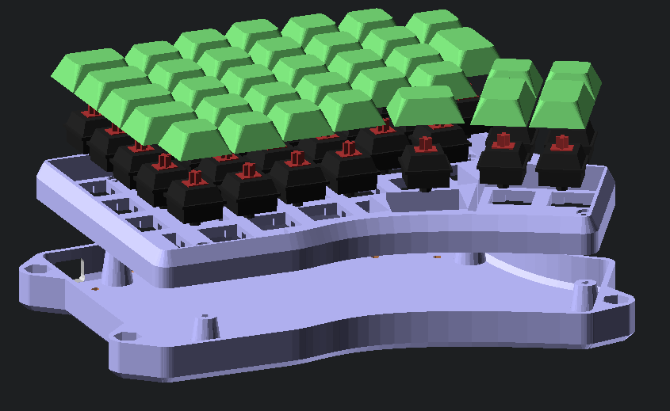
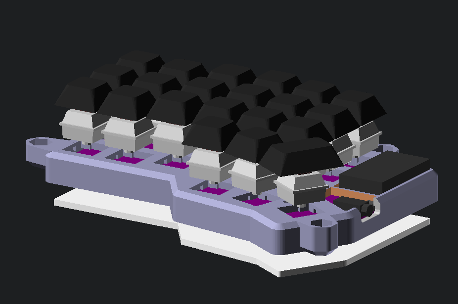
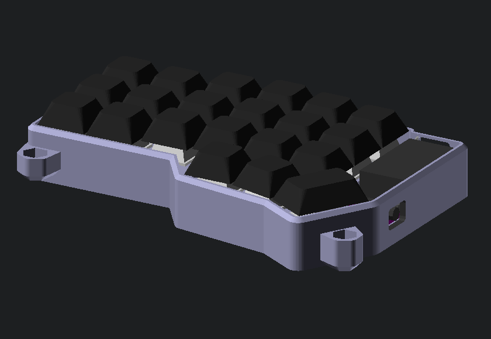
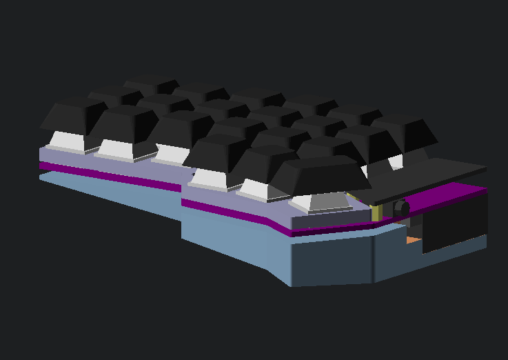

# OpenSCAD Mechanical Keyboard Cases

This repository uses OpenSCAD to make 3D-printable keyboard
cases. Initially this was simple modifications to an existing case for
the [Redox](https://github.com/mattdibi/redox-keyboard) handwire
keyboard, but now also provides the possibility to make a new case
generated in OpenSCAD from scratch.

When cloning, you need to make sure you get the submodules, e.g.:

    git clone --recurse-submodules https://github.com/Lenbok/scad-keyboard-cases.git

## Modified Version Of The Redox Case

Have a look in [redox-rev0-mod](redox-rev0-mod) for my modification of
the original handwire Redox case.

## Keyboard Cases From Scratch

I then wanted to design a new case for the Redox that was inspired both
by the Redox Rev1 case and the Iris, and I thought it would be nice to
start with the layout from the [Keyboard Layout
Editor](http://www.keyboard-layout-editor.com/) JSON file (in this way
it could be extended to other keyboards). Existing tools I had found for
going from KLE JSON to OpenSCAD didn't work for split keyboards where
some keys are rotated, so an updated tool is provided here that seems to
work on the split keyboards I have tried.

Examples: [Redox](redox-rev0b) and [Corne](crkbd) keyboards.

If you have another KLE JSON file you want to convert, run the included
`jsonPositions.py` which spits out the key layout to a minimal OpenSCAD
data structure along with some data access functions. E.g:

    python3 jsonPositions.py -v redox_layout <redox-rev0b/redox-layout.json >redox-rev0b/redox-layout.scad

Where `-v redox_layout` designates the OpenSCAD variable name used to
contain the layout data in the generated file.  Then make a top level
OpenSCAD that includes this along with `keyboard_case.scad`, e.g.:

    include <redox-rev0b/redox-layout.scad>
    include <keyboard_case.scad>

Then to make a case, you mostly just need to define a polygon describing the
outer boundary of your desired case, a set of points for where to put
case screw holes, and optional positions for tenting supports, and call
the `top_case` and/or `bottom_case` modules. 

See some of the cases here for examples:

Redox:

CRKBD (main shell is top half):

CRKBD "alternate" (hi-profile, main shell is lower half):

CRKBD "minimal" (here using bottom mount mcu and reset for low profile):

