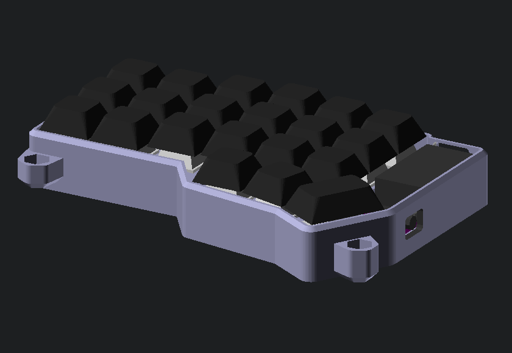

## CRKBD keyboard cases from scratch

In this folder are a couple of different cases for the
[Corne](https://github.com/foostan/crkbd) keyboard.

### Default case (AKA first version)

This has a top plate with tenting supports attached. The bottom plate
could be 3D printed in transparent plastic so that underglow shows
through (it should also be compatible with the laser cut acrylic bottom
plate).

The top part has a couple of struts across where the OLED screen goes
that are purely to assist with keeping the edge attached during
printing, and these should be cut out after printing. The outermost
tenting mounts are raised compared to the inner ones, this is to allow
the outer sides to sit closer to the desk.

I've also designed a simple carrier that each half of the keyboard slots
into, and which has a wee compartment into which you can put the TRRS
cable and tenting legs during transport.

### "Alternate" case

This version of the case has a simple printed top plate (essentially as
thick as possible for strength - you may need to clip diode legs etc),
and the bottom half contains the tenting etc. This version is "high
profile" where the sides come up to the bottom of the keycaps:

The tenting positions are differently arranged, but you can use the
definitions from the default case if you prefer those.

If you want this case to be compatible with RGB underglow lighting, it's
best to print the first few mm in transparent filament before swapping
to the color you want for the bulk of the case.

Mine is using a top mounted
[nRFMicro](https://github.com/joric/nrfmicro) for bluetooth, and has a
separate LiPo battery bay.

Here are the default and alternate cases:

### "Minimal" case

This version of the case has the same simple top plate as the alternate
case, and the bottom is pretty much a wedge shape so we have the minimal
footprint. You can configure whether you want the MCU and/or the reset
switch mounted under the PCB (this allows the OLED to sit close to the
PCB).

Mine is using a bottom mounted
[nRFMicro](https://github.com/joric/nrfmicro) which also straddles a
small LiPo, making it a nice compact bluetooth keyboard.

