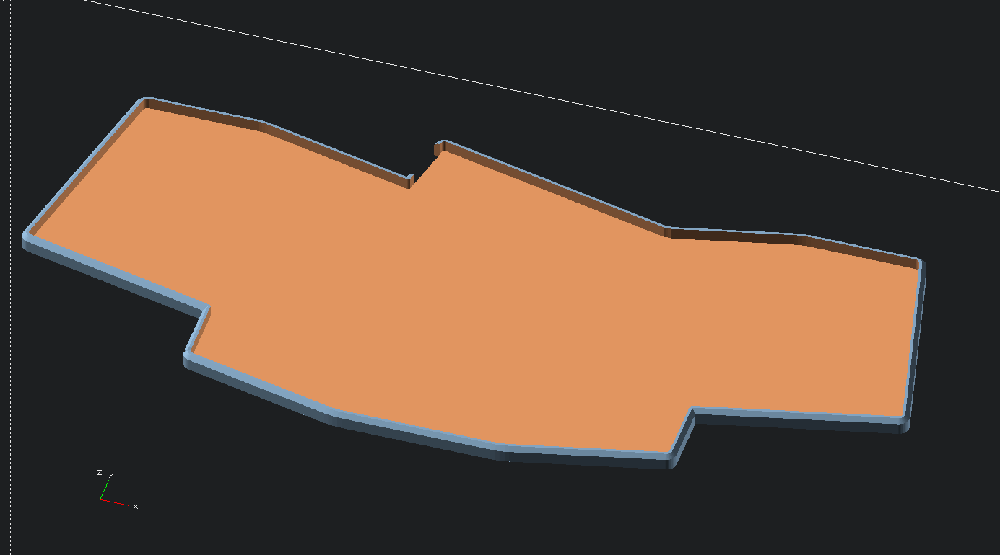
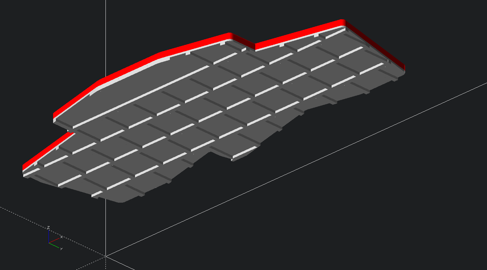

## Humla keyboard cases

In this folder are a couple of different cases for the
[Humla](https://github.com/jimmerricks/humla) keyboard.

### Simple bumper

Just a straight bumper-style case:

At the moment, the case does not attach with screws, it just fits snugly.

### "Laptop Adaptor" case

Since one use case when building this keyboard was as an comfortable
alternative to the keyboard built-in to my work laptop (a HP Zenbook), this
case is an adaptor that lets the humla sit over the top of the laptop
keyboard. Recesses corresponding to the laptop keys keep the humla positioned.

To make this case, print one adaptor plate and one bumper plate and glue them
together.

It would be easy to alter this for a different laptop by creating a KLE layout
containing the positions and sizes of your laptop keyboard, and running the
converter in this repo to convert that into the OpenSCAD data structure
required.

